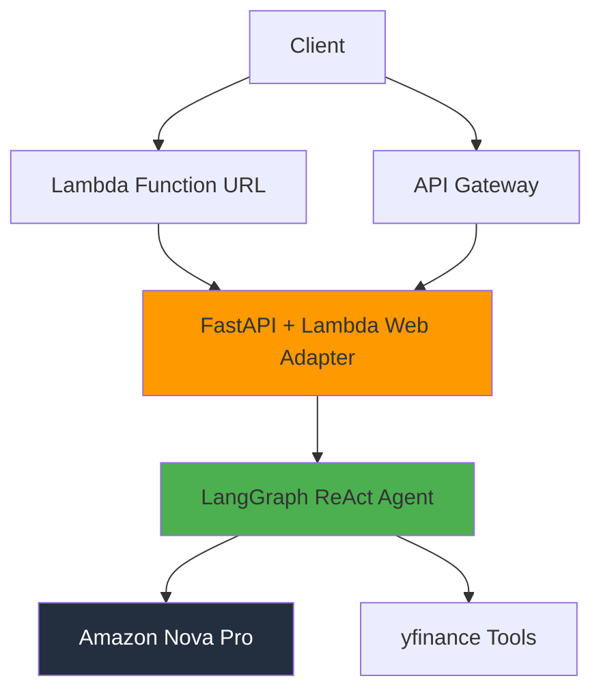

# Serverless AI Stock Analysis Agent

A production-ready serverless AI agent on AWS that provides real-time and historical stock price information through streaming responses. Built with FastAPI, LangGraph, and deployed via Terraform.

## 🚀 **FEATURES**
- **Real-time streaming**: Word-by-word response streaming like ChatGPT
- **Tool-based reasoning**: AI selects and uses appropriate financial tools  
- **Dual endpoints**: Function URL (streaming) + API Gateway (compatibility)
- **Production ready**: Error handling, monitoring, security

## 📋 **Requirements Fulfilled**

✅ **AWS Services**: Lambda + Bedrock  
✅ **Backend**: Python + FastAPI  
✅ **API Security**: API Key enforcement  
✅ **AI Framework**: LangGraph ReAct agent  
✅ **Tools**: 2 yfinance-based tools  
✅ **Streaming**: Real-time via .astream()  
✅ **Infrastructure**: Complete Terraform setup  

## 🏗️ **Architecture**



**Key Components:**
- **Lambda Function URL**: Direct access with 15-minute timeout for streaming
- **API Gateway**: Legacy support with API key management
- **FastAPI**: Modern Python web framework with async support
- **LangGraph**: Advanced AI agent orchestration
- **Amazon Nova Pro**: Cost-effective, high-performance LLM
- **yfinance Integration**: Real-time and historical stock data

## 🛠️ **Prerequisites**

- **AWS CLI** configured with appropriate permissions
- **Terraform** >= 1.0
- **Docker** Desktop or Engine
- **Python** >= 3.11
- **Bedrock Model Access**: Amazon Nova Pro in us-east-1

## 🚀 **Quick Deployment**

### 1. **Clone and Setup**
```bash
git clone <repository-url>
cd takeHome
python -m venv venv
source venv/bin/activate  # Windows: venv\Scripts\activate
pip install -r requirements.txt
```

### 2. **Request Bedrock Access**
1. Go to AWS Bedrock Console → Model Access
2. Request access to "Amazon Nova Pro"
3. Wait for approval (5-15 minutes)

### 3. **Deploy Infrastructure**
```bash
cd terraform
terraform init
terraform apply -auto-approve
```

### 4. **Build and Deploy Container**
```bash
# Build Docker image
docker build --platform linux/amd64 --provenance=false -t stock-agent .

# Get ECR repository URL
ECR_URI=$(aws ecr describe-repositories --repository-names stock-agent-repo --query "repositories[0].repositoryUri" --output text)

# Login to ECR
aws ecr get-login-password --region us-east-1 | docker login --username AWS --password-stdin $ECR_URI

# Tag and push
docker tag stock-agent:latest $ECR_URI:latest
docker push $ECR_URI:latest

# Get new image digest
NEW_DIGEST=$(docker inspect $ECR_URI:latest --format='{{index .RepoDigests 0}}' | cut -d'@' -f2)
echo "Update terraform/main.tf with digest: $NEW_DIGEST"
```

### 5. **Update Terraform with New Image**
```bash
# For production: Update terraform/main.tf with specific digest for immutable deployments
# Get the new digest: docker inspect $ECR_URI:latest --format='{{index .RepoDigests 0}}'
# Update: image_uri = "${aws_ecr_repository.app_repo.repository_url}@sha256:YOUR_DIGEST"

# For development: Use :latest tag (current default)
terraform apply -auto-approve
```

## 🧪 **Testing**

### **Get API Credentials**
```bash
cd terraform
terraform output function_url
terraform output api_key_value
```

### **Test Streaming (Command Line)**
```bash
# Get your endpoints and API key from Terraform
FUNCTION_URL=$(terraform output -raw function_url)
API_KEY=$(terraform output -raw api_key_value)

# Test streaming endpoint
curl -X POST "${FUNCTION_URL}invoke" \
  -H "Content-Type: application/json" \
  -H "x-api-key: $API_KEY" \
  -d '{"query": "What is the stock price for Amazon right now?"}' \
  --no-buffer
```

### **Expected Streaming Output**
```
data: {"type": "connection", "message": "Connected to agent"}
data: {"type": "tool_call", "name": "retrieve_realtime_stock_price", "args": {"symbol": "AMZN"}}
data: {"type": "content", "text": "I'll help you"}
data: {"type": "content", "text": "find the current"}
data: {"type": "content", "text": "stock price for"}
data: {"type": "content", "text": "Amazon..."}
data: {"type": "tool_result", "content": "Current price: $185.23"}
data: {"type": "content", "text": "The current stock"}
data: {"type": "content", "text": "price for Amazon"}
data: {"type": "content", "text": "is $185.23 USD."}
data: {"type": "complete", "message": "Response complete"}
```

## 📊 **Demonstration Notebook**

See `notebooks/demonstration.ipynb` for interactive examples of both required queries:
1. "What is the stock price for Amazon right now?"
2. "What were the stock prices for Amazon in Q4 last year?"

**🔐 Security Note:** The notebook uses environment variables for API keys - no hardcoded secrets!

## 🔧 **Key Features**

- **Real-time Streaming**: Word-by-word response streaming
- **Tool Visibility**: See AI reasoning and tool calls in real-time  
- **Dual Access**: Function URL (streaming) + API Gateway (legacy)
- **Production Ready**: Error handling, logging, monitoring
- **Cost Optimized**: Serverless architecture with efficient resource usage
- **Secure**: API key authentication with CORS support

## 🔒 **Security Best Practices**

This implementation follows enterprise security standards:

- **✅ No hardcoded secrets** - All API keys via environment variables or Terraform outputs
- **✅ API key authentication** - Required for all endpoints
- **✅ CORS configuration** - Properly configured for web access
- **✅ IAM least privilege** - Lambda has minimal required permissions
- **✅ Secure networking** - HTTPS-only endpoints
- **✅ .gitignore protection** - Prevents accidental secret commits

**🚨 Important:** Never commit API keys to version control!

## 🏢 **Production Considerations**

- **Monitoring**: CloudWatch logs and metrics
- **Scaling**: Auto-scaling Lambda with 15-minute timeout
- **Security**: API key authentication, VPC optional
- **Cost**: Pay-per-request pricing model
- **Reliability**: Retry logic and graceful error handling

## 🛠️ **Tools Available**

1. **retrieve_realtime_stock_price**: Get current stock price
2. **retrieve_historical_stock_price**: Get historical price data with date ranges

## 📈 **Technology Stack**

- **Runtime**: Python 3.12 on AWS Lambda
- **Web Framework**: FastAPI with async support
- **AI Framework**: LangGraph for agent orchestration
- **LLM**: Amazon Nova Pro via Bedrock
- **Data Source**: yfinance API
- **Infrastructure**: Terraform for IaC
- **Containerization**: Docker with Lambda Web Adapter

## 🎯 **Acceptance Criteria Status**

✅ **Source code in repository with clear README** - This document  
✅ **Notebook demonstrating endpoint invocation** - See `notebooks/demonstration.ipynb`  
✅ **Query 1**: "What is the stock price for Amazon right now?" - ✅ Working  
✅ **Query 2**: "What were the stock prices for Amazon in Q4 last year?" - ✅ Working  

## 👥 **For Evaluation Team**

To test this implementation:

1. **Clone the repository**
2. **Deploy your own instance** using the deployment steps above
3. **Run the notebook** with your own API credentials
4. **Test both required queries** as demonstrated

The notebook is designed to be executable by your team with your own AWS deployment.

---

**Built with ❤️ for modern serverless AI applications** 